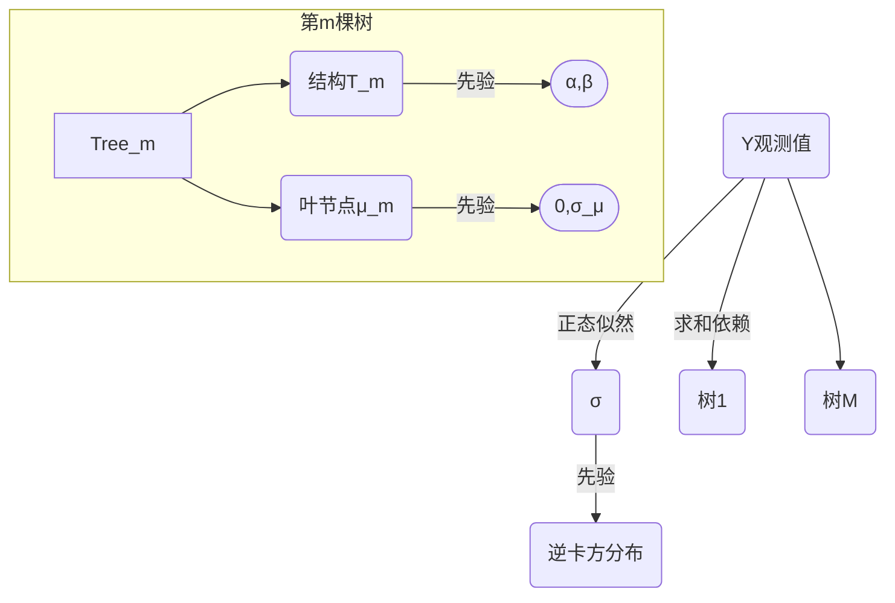

让我们分步拆解**贝叶斯加性回归树（BART, Bayesian Additive Regression Trees）**的核心机制与应用逻辑。以下解释将结合技术原理、数学表达和实际案例，尽可能还原其本质。

---

### **Step 1: 基础定义——BART是什么？**
> **核心定位**：一种非参数贝叶斯回归方法，通过集成大量弱学习树（weak-learner trees）提升预测鲁棒性，特别适合处理非线性关系与异方差数据。

**关键特性**：
| 维度 | 说明 |
|------|------|
| **加性 (Additive)** | 最终预测由M棵回归树的输出**求和**构成：  \( Y = \sum_{m=1}^M g_m(\mathbf{X}; \mathcal{T}_m, \mathcal{M}_m) + \epsilon \)  ➠ 每棵树\(g_m\)捕捉数据的不同模式 |
| **贝叶斯 (Bayesian)** | 为每棵树的**结构**（\(\mathcal{T}_m\)）和**叶节点参数**（\(\mathcal{M}_m\)）赋予先验分布，通过后验抽样拟合 |
| **回归树 (Regression Trees)** | 每棵树是CART（分类回归树）结构，但通过概率框架控制复杂度 |

---

### **Step 2: 技术拆解——BART如何工作？**
#### **2.1 单棵树的生成规则**
一棵回归树\(g_m\)可表示为：  
\( g_m(\mathbf{X}) = \mu_{m,l} \)，其中 \( l \) 是输入 \(\mathbf{X}\) 落入的叶节点  
叶节点值 \(\mu_{m,l}\) 服从**正态先验**： \(\mu_{m,l} \sim \mathcal{N}(0, \sigma_\mu^2)\)

**复杂度控制**（防过拟合）：  
- 树深度先验：P(分裂) ∝ α(1+d)^{-β} （d=当前深度）  
- 默认设置：α=0.95, β=2 → 倾向生成浅树

#### **2.2 加性集成机制**
对于M棵树（通常M=200），预测值为：  
\[ \hat{Y} = \sum_{m=1}^M g_m(\mathbf{X}) \]  
*注：与随机森林（Random Forest）的区别——*  
| BART | 随机森林 |
|------|----------|
| **贝叶斯平均**：后验推断权重 | **投票平均**：等权重集成 |
| 树间**强正则化**（小\(\mu\)先验） | 树独立生长（无强约束） |

#### **2.3 完整的概率图模型**

---

### **Step 3: 贝叶斯推断——如何训练BART？**
采用**MCMC算法**（具体为Gibbs抽样），交替更新以下变量：
1. **树结构\(\mathcal{T}_m\)**：  
   - 通过"生长-剪枝-交换-旋转"操作扰动树形  
   - 接受概率由贝叶斯因子决定：  
     $$ \frac{P(\mathcal{T}_m^{\text{new}} \mid \mathbf{Y})}{P(\mathcal{T}_m^{\text{old}} \mid \mathbf{Y})} = \frac{P(\mathbf{Y} \mid \mathcal{T}_m^{\text{new}}) \cdot P(\mathcal{T}_m^{\text{new}})}{P(\mathbf{Y} \mid \mathcal{T}_m^{\text{old}}) \cdot P(\mathcal{T}_m^{\text{old}})} $$
2. **叶节点值\(\mu_{m,l}\)**：  
   固定树结构时，$\mu_{m,l}$ 的**后验也是正态分布**：  
    $$\mu_{m,l} \mid \cdots \sim \mathcal{N}\left( \frac{\sum_{i \in S_l} r_i}{\sigma^{-2} + n_l \cdot \sigma_\mu^{-2}},  \frac{1}{\sigma^{-2} + \sigma_\mu^{-2}} \right)$$ 
   （\(S_l\)=叶节点l的样本集，\(r_i = Y_i - \sum_{k \neq m} g_k(\mathbf{X}_i)\)为残差）
3. **噪声方差\(\sigma^2\)**：  
   更新公式： \(\sigma^2 \mid \cdots \sim \text{Inv-Gamma}\left( \frac{\nu_0 + n}{2}, \frac{\nu_0 \lambda_0 + \text{RSS}}{2} \right)\)  
   （RSS = 残差平方和）

> **为什么高效？**  
> - 残差拟合：每棵树仅拟合其他树的**残差**（类似Boosting）  
> - 并行化：MCMC中可批量更新多棵树（软件如`bartMachine`实现此优化）

---

### **Step 4: 为什么BART适合因果推断？** （关联论文核心）
#### **案例：估计处理效应\(\tau = E[Y(1) - Y(0)]\)**
假设数据：\( \mathbf{X} \)为协变量，\( Z \)为处理指示（0/1），观测\(Y = Z \cdot Y(1) + (1-Z) \cdot Y(0)\)

**BART实施步骤**：
1. 分别拟合两个模型：  
   - 处理组模型： \( Y \mid \mathbf{X}, Z=1 \sim \text{BART}_1(\mathbf{X}) \)  
   - 控制组模型： \( Y \mid \mathbf{X}, Z=0 \sim \text{BART}_0(\mathbf{X}) \)  
2. 预测潜在结果：  
   - \( \hat{Y}_i(1) = \text{BART}_1(\mathbf{X}_i) \)  
   - \( \hat{Y}_i(0) = \text{BART}_0(\mathbf{X}_i) \)  
3. 计算个体处理效应：  
   \[ \hat{\tau}_i = \hat{Y}_i(1) - \hat{Y}_i(0) \]

**优势**：
- 自动捕获协变量与处理的**复杂交互**（如非线性/异质性效应）
- 通过后验分布给出**不确定性量化**：  
  \( P(\tau > 0 \mid \mathbf{X}) \) 直接由MCMC样本计算
- **倾向得分作为输入**：在\(\mathbf{X}\)中加入\(\hat{e}(\mathbf{X}) = P(Z=1 \mid \mathbf{X})\)，缓解混杂偏倚

#### **论文关键例证（Example 4.1）**
- **问题**：当协变量分布存在**低重叠区**（poor overlap，如X<40），传统线性模型失效  
- **BART表现**：  
  1. 在重叠区（40≤X≤50）给出无偏估计  
  2. 在低重叠区（X<40）可信区间（CrI）**过窄** → 低估不确定性（论文Fig.1）  
  *启示：BART需与协变量平衡技术结合使用*

---

### **Step 5: BART的局限与改进方向**
基于论文§4的批判：
1. **正则化依赖先验**：  
   - 小\(\mu\)先验迫使预测平滑 → 在极端区域（如协变量外推）预测偏差
2. **不确定性低估问题**：  
   - MCMC未考虑模型不确定性 → 可扩展为**贝叶斯模型平均**（BMA-BART）
3. **计算开销**：  
   - MCMC比boosting/RF慢 → 使用变分推断或GPU加速（如`XGBART`）

> **最新进展**：  
> - **稀疏BART**（Sparse BART）：引入变量选择先验  
> - **半参数BART**：混合参数模型（如处理效应线性）与非参数部分

---

### **本质总结**
BART是将**集成学习**（加法树）与**贝叶斯推断**（概率正则化）融合的框架：  
- **预测**：通过加性树结构逼近复杂函数  
- **推断**：利用贝叶斯后验量化不确定性  
- **因果应用**：双模型结构天然适配潜在结果框架，但需警惕**协变量平衡**要求

它的强大在于：**以概率语言包裹非参数模型**，既保留灵活性又提供统计严谨性——这正是现代因果推断亟需的特性。

> 详细解释：https://zhuanlan.zhihu.com/p/444501704