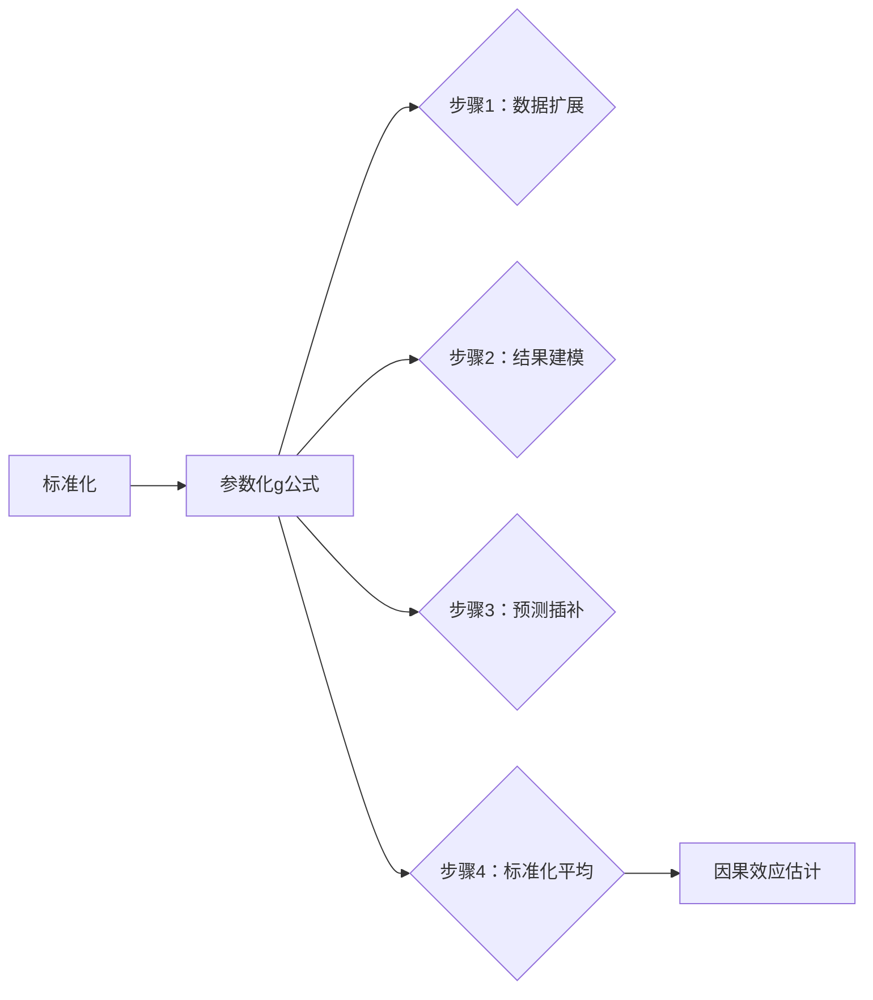

以下是第13章的核心内容总结，使用标准Markdown和LaTeX数学公式格式：

---

### **核心概念**
1. **标准化方法**  
   - 估计戒烟（$A=1$） vs. 不戒烟（$A=0$）对体重增加（$Y$）的平均因果效应：  
     $$
     E[Y^{a=1,c=0}] - E[Y^{a=0,c=0}]
     $$
   - 在可交换性、正性和一致性条件下，标准化均值估计反事实期望：
     $$
     E[Y^{a,c=0}] = \sum_l E[Y|A=a,C=0,L=l] \cdot \Pr[L=l]
     $$

2. **参数化g公式**  
   - 当协变量$L$维度高时，需用参数模型估计条件结果期望：
     - 线性回归模型：$E[Y|A=a,C=0,L=l] = \beta_0 + \beta_1 a + \beta_2^T l + \beta_3^T (a \cdot l)$  
   - 标准化步骤：
     - **数据扩展**：复制数据集三份（原始数据、全设$A=0$、全设$A=1$）  
     - **结果建模**：用原始数据拟合$E[Y|A,L]$  
     - **预测**：为扩展数据集插补$Y$  
     - **标准化**：计算$A=1$和$A=0$块的预测均值差异 → 因果效应估计

---

### **关键结论（Fine Points）**
1. **结构正性问题（Fine Point 13.1）**  
   - **核心结论**：当$\Pr[A=a|L=l]=0$时：  
     - IP加权无法识别因果效应（分母为零）  
     - 标准化可通过**参数模型外推**（但引入模型依赖的偏倚）  
   - **影响对比**：  
     - 标准化在正性违反时标准误更小，但偏倚可能更大  

2. **双稳健估计（Fine Point 13.2）**  
   - **Bang-Robins估计器**：  
     - 扩展结果模型：$E[Y|A,L,R]$，其中$R = \frac{A}{\hat{\pi}(L)} - \frac{1-A}{1-\hat{\pi}(L)}$  
     - 估计$E[Y^{a}]$时预测$A=a$下的$Y$并平均  
   - **性质**：  
     - 若处理模型$\hat{\pi}(L)$或结果模型$\hat{b}(L)$之一正确，则因果效应估计一致  

3. **增强IP加权（Technical Point 13.2）**  
   - 估计器形式：  
     $$
     \hat{E}[Y^{a=1}]_{DR} = \frac{1}{n} \sum_{i=1}^n \left[ \frac{A_i Y_i}{\hat{\pi}(L_i)} - \frac{A_i - \hat{\pi}(L_i)}{\hat{\pi}(L_i)} \hat{b}(L_i) \right]
     $$
   - **二阶偏倚**：偏倚取决于$(\frac{1}{\hat{\pi}} - \frac{1}{\pi}) \cdot (b - \hat{b})$  

---

### **IP加权 vs. 标准化**
| **方法**       | **依赖模型**       | 高维数据表现       | 正性违反敏感性 |
|----------------|-------------------|------------------|--------------|
| **IP加权**     | 处理模型 $\Pr[A|L]$ | 方差大           | 高（分母接近零） |
| **标准化**     | 结果模型 $E[Y|A,L]$ | 更稳定           | 低（可外推）   |
| **双稳健**     | 任一模型正确       | 最优（结合两者优势）| 低           |

- **等价性**：无模型时两者等价（Technical Point 2.3）  
- **实践建议**：同时使用两种方法，差异大提示模型误设  

---

### **估计可靠性（13.5节）**
因果推断需满足：  
1. **可交换性**：无未测量混杂（$Y^a \perp\!\!\!\perp A \mid L$）  
2. **正性**：$\Pr[A=a|L=l] > 0 \quad \forall l$  
3. **一致性**：观测$Y = Y^a$当$A=a$  
4. **无测量误差**：$A$, $Y$, $L$准确测量  
5. **模型正确指定**：参数模型反映真实结构  

**敏感度分析必要**：  
- 未测量混杂（E值）、选择偏倚、模型误设需量化敏感性  
- **例**：戒烟效应估计$3.5$kg ($95\%\ \text{CI: } 2.6, 4.5$)，但依赖强假设  

---

### **公式符号表**
| **符号**       | 含义                          |
|---------------|------------------------------|
| $Y^{a,c=0}$   | 处理为$a$且未删失时的潜在结果   |
| $\hat{\pi}(L)$| 倾向评分估计 $\Pr[A=1\|L]$    |
| $\hat{b}(L)$  | 结果期望估计 $E[Y\|A,L]$      |
| $DR$          | 双稳健 (Doubly Robust)        |

