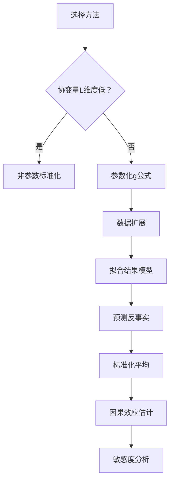

### **标准化方法（Standardization）**

#### **原理**
标准化是一种非参数方法，用于估计**反事实期望** $$E[Y^{a,c=0}]$$（在干预设定所有人接受处理 \(a\) 且未删失时的潜在结果均值）。其核心思想是通过对混杂变量 \(L\) 的分布进行调整，消除混杂偏倚：
\[
$$E[Y^{a,c=0}] = \sum_{l} E[Y \mid A=a, C=0, L=l] \cdot \Pr[L=l]$$
\]
- **可交换性**：当 \(L\) 充分调整混杂时，组间可比（\(Y^a \perp\!\!\!\perp A \mid L\)）。
- **正性**：所有 \(L\) 层中处理概率非零（\(\Pr[A=a \mid L=l] > 0\)）。
- **一致性**：观测结果等于潜在结果（若 \(A_i=a\)，则 \(Y_i = Y_i^a\)）。

#### **使用方法**
1. **分层估计**：
   - 将数据按混杂变量 \(L\) 的值分层（如性别、年龄组）。
   - 计算每层内处理组 \(A=a\) 的均值 \(E[Y \mid A=a, C=0, L=l]\)。
2. **加权平均**：
   - 用总体中 \(L=l\) 的比例 \(\Pr[L=l]\) 作为权重，对层均值加权求和。
   - **公式**：
     \[
     \hat{E}[Y^{a,c=0}] = \sum_{l} \hat{E}[Y \mid A=a, C=0, L=l] \cdot \frac{n_l}{n}
     \]
     \(n_l\) 为 \(L=l\) 的样本量，\(n\) 为总样本量。

#### **注意事项**
- **低维数据适用**：当 \(L\) 维度低且离散时可行（如仅3-5个类别）。
- **高维问题**：若 \(L\) 包含连续变量或多类别（如年龄、体重），分层后某些层样本极少，估计不稳定（**维度灾难**）。
- **正性违反**：若某层 \(\Pr[A=a \mid L=l]=0\)（如男性高龄者无戒烟者），则该层无法估计，需依赖模型外推（引入偏倚风险）。

---

### **参数化g公式（Parametric g-formula）**
#### **原理**
g公式是标准化的**参数化推广**，用于解决高维混杂问题：
\[
E[Y^{a,c=0}] = \int E[Y \mid A=a, C=0, L=l]  dF_L(l)
\]
- 通过参数模型估计 \(E[Y \mid A, L]\)，避免直接分层。
- 用经验分布 \(\hat{F}_L(l)\)（样本分布）替代理论分布 \(F_L(l)\)，实现“自动加权”。

#### **使用方法（四步法）**
1. **数据扩展**：
   - 复制原始数据集为三份：
     - **Block 1**：原始观测数据（保留 \(A, Y, L\)）。
     - **Block 2**：强制所有个体 \(A=0\)，\(Y\) 设为缺失。
     - **Block 3**：强制所有个体 \(A=1\)，\(Y\) 设为缺失。
   ```mermaid
   graph LR
   D[原始数据] --> B1[Block 1: A,Y,L 保留]
   D --> B2[Block 2: A=0, Y缺失]
   D --> B3[Block 3: A=1, Y缺失]
   ```

2. **结果建模**：
   - 用 **Block 1** 拟合回归模型：
     \[
     Y = \beta_0 + \beta_1 A + \beta_2^T L + \beta_3^T (A \times L) + \epsilon
     \]
     - 例如：包含年龄、体重的二次项及交互项。

3. **预测潜在结果**：
   - 用模型预测 **Block 2** 和 **Block 3** 的 \(Y\)：
     - Block 2：\(\hat{Y}_i^{a=0} = \hat{E}[Y \mid A=0, L=l_i]\)
     - Block 3：\(\hat{Y}_i^{a=1} = \hat{E}[Y \mid A=1, L=l_i]\)

4. **标准化平均**：
   - 计算反事实均值：
     \[
     \hat{E}[Y^{a}] = \frac{1}{n} \sum_{i=1}^n \hat{Y}_i^{a}
     \]
   - 因果效应：\(\hat{\tau} = \hat{E}[Y^{a=1}] - \hat{E}[Y^{a=0}]\)

#### **注意事项**
1. **模型依赖性**：
   - 结果模型 \(E[Y \mid A,L]\) 必须正确指定（如非线性关系需多项式项）。
   - **误设后果**：若模型遗漏重要交互项（如 \(A \times \text{年龄}\)），效应估计偏倚。

2. **正性问题处理**：
   - 当某 \(L=l\) 下无个体接受处理（\(\Pr[A=a \mid L=l]=0\)），模型通过**外推**预测 \(Y\)。
   - **风险**：外推部分无数据支持，依赖模型假设（需敏感性分析）。

3. **双稳健性缺失**：
   - 传统g公式仅依赖结果模型。
   - **改进**：用双稳健估计（见Fine Point 13.2），结合处理模型 \(\Pr[A=a \mid L]\) 增强可靠性。

4. **置信区间计算**：
   - 使用**Bootstrap法**（Technical Point 13.1）：
     - 重抽样 \(B\) 次（如 \(B=1000\)），每次重复g公式步骤。
     - 取2.5%和97.5%分位数作为95% CI。

---

### **关键对比：标准化 vs. 参数化g公式**
| **特性**         | **标准化**                    | **参数化g公式**               |
|------------------|-----------------------------|-----------------------------|
| **适用维度**     | 低维 \(L\)（离散、少类别）    | 高维 \(L\)（连续、多类别）    |
| **模型依赖**     | 非参数（无模型）             | 需指定结果模型 \(E[Y\|A,L]\) |
| **正性违反**     | 无法计算（层内无数据）        | 模型外推（可能偏倚）          |
| **计算复杂度**   | 简单（直接加权）             | 较高（需数据扩展、预测）      |
| **稳定性**       | 高（方差小）                 | 依赖模型质量                 |

---

### **实践建议**
1. **首选双稳健方法**（如Bang-Robins估计器）：
   - 同时拟合处理模型 \(\pi(L)\) 和结果模型 \(b(L)\)。
   - 只要一个模型正确，效应估计即一致。

2. **敏感性分析**：
   - **模型误设**：尝试不同模型规格（如添加/删除交互项）。
   - **未测量混杂**：使用E值量化混杂强度（Fine Point 7.1）。
   - **正性**：检查 $$\hat{\pi}(L)$$ 的分布，避免接近0的值。

3. **报告结果**：
   - 同时给出IP加权和g公式估计，若差异 >10%，提示模型问题。
   - 示例：戒烟效应估计为3.5kg，但需声明依赖可交换性等强假设。

