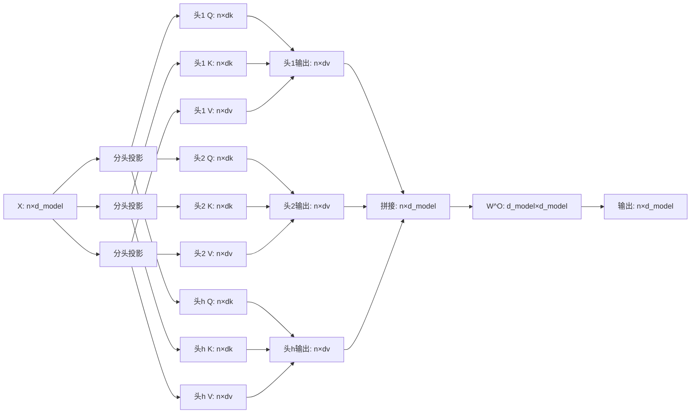

### 多头注意力（Multi-Head Attention）数学详解

多头注意力是 Transformer 的核心机制，它通过并行执行多个独立的注意力头（attention heads）来捕捉输入的不同表示子空间。以下是完整的数学推导（所有公式用 `$` 包裹）：

---

#### **1. 输入表示**
输入序列矩阵：
$$
X \in \mathbb{R}^{n \times d_{\text{model}}}
$$
其中：
- $n$：序列长度
- $d_{\text{model}}$：模型维度（如 512）

---

#### **2. 多头投影**
对每个头 $i \in \{1, 2, \dots, h\}$，使用独立的权重矩阵进行投影：
$$
\begin{align*}
Q_i &= X \cdot W_i^Q, \quad &W_i^Q \in \mathbb{R}^{d_{\text{model}} \times d_k} \\
K_i &= X \cdot W_i^K, \quad &W_i^K \in \mathbb{R}^{d_{\text{model}} \times d_k} \\
V_i &= X \cdot W_i^V, \quad &W_i^V \in \mathbb{R}^{d_{\text{model}} \times d_v}
\end{align*}
$$
参数说明：
- $h$：头数（如 8）
- $d_k = d_v = \frac{d_{\text{model}}}{h}$：每个头的维度（如 64）
- 投影后维度：$Q_i, K_i \in \mathbb{R}^{n \times d_k}$，$V_i \in \mathbb{R}^{n \times d_v}$

---

#### **3. 单头注意力计算**
对每个头 $i$ 独立计算缩放点积注意力：
$$
\text{head}_i = \text{Attention}(Q_i, K_i, V_i) = \text{softmax}\left( \frac{Q_i K_i^T}{\sqrt{d_k}} \right) V_i
$$
其中：
- $\frac{Q_i K_i^T}{\sqrt{d_k}} \in \mathbb{R}^{n \times n}$：缩放后的注意力分数矩阵
- 输出维度：$\text{head}_i \in \mathbb{R}^{n \times d_v}$

---

#### **4. 多头输出拼接**
将所有头的输出在特征维度拼接：
$$
\text{MultiHead}(Q, K, V) = \text{Concat}(\text{head}_1, \text{head}_2, \dots, \text{head}_h)
$$
拼接后维度：$\text{Concat}(\cdots) \in \mathbb{R}^{n \times (h \cdot d_v)} = \mathbb{R}^{n \times d_{\text{model}}}$

---

#### **5. 输出线性变换**
将拼接结果通过可学习权重矩阵 $W^O$ 投影回模型维度：
$$
\text{Output} = \text{Concat}(\text{head}_1, \dots, \text{head}_h) \cdot W^O, \quad W^O \in \mathbb{R}^{d_{\text{model}} \times d_{\text{model}}}
$$
最终输出维度：$\mathbb{R}^{n \times d_{\text{model}}}$

---

### **完整数学公式汇总**
$$
\boxed{
\begin{align*}
& \text{MultiHead}(X) = \text{Concat}(\text{head}_1, \dots, \text{head}_h) \cdot W^O \\
& \text{where} \quad \text{head}_i = \text{softmax}\left( \frac{(X W_i^Q)(X W_i^K)^T}{\sqrt{d_k}} \right) (X W_i^V) \\
& \text{with} \quad 
\begin{cases} 
d_k = d_v = \dfrac{d_{\text{model}}}{h} \\
W_i^Q, W_i^K \in \mathbb{R}^{d_{\text{model}} \times d_k} \\
W_i^V \in \mathbb{R}^{d_{\text{model}} \times d_v} \\
W^O \in \mathbb{R}^{d_{\text{model}} \times d_{\text{model}}}
\end{cases}
\end{align*}
}
$$

---

### **维度变化可视化**
```
输入 X: [n, d_model]
│
├─ Head 1 ──┐
│ Q1 = X·W1^Q [n, d_k]  │
│ K1 = X·W1^K [n, d_k]  → Attn1 [n, n] → head1 [n, d_v]
│ V1 = X·W1^V [n, d_v]  │               │
├─ Head 2 ──┤                              │
│ ...      │                              ├→ Concat [n, h·d_v] = [n, d_model]
├─ Head h ──┤                              │
│          │                              │
└──────────┘                              │
                                          │
Output = Concat·W^O [n, d_model] ←────────┘
```




---

### **数学优势分析**
1. **子空间分解**  
   每个头学习不同的投影：
   $$
   W_i^Q, W_i^K, W_i^V \text{ 相互独立}
   $$
   使模型关注不同方面的信息（如语法/语义/位置）。

2. **计算效率**  
   虽然头数 $h$ 增加，但单头维度 $d_k$ 减小：
   $$
   \text{单头计算量} = O(n^2 d_k) = O\left(n^2 \frac{d_{\text{model}}}{h}\right)
   $$
   总计算量 $O(n^2 d_{\text{model}})$ 与单头相同。

3. **表达能力增强**  
   输出是多个子空间的非线性组合：
   $$
   \text{Output} = f\left( \sum_{i=1}^h \text{head}_i \cdot W^O_i \right)
   $$
   （$W^O$ 隐含分解为子矩阵 $W^O_i$）

---

### **实例演算**
设 $d_{\text{model}} = 4$, $h = 2$, 则 $d_k = d_v = 2$  
输入 $X = \begin{bmatrix} 1 & 0.5 & -1 & 2 \\ -0.5 & 1 & 0.3 & -2 \end{bmatrix}$

**头1计算**：
$$
W_1^Q = \begin{bmatrix} 0.1 & 0.4 \\ -0.2 & 0.3 \\ 1.0 & -0.5 \\ 0.5 & 0.2 \end{bmatrix}, \ 
Q_1 = X W_1^Q = \begin{bmatrix} 0.85 & -0.05 \\ -0.29 & 0.74 \end{bmatrix}
$$
（类似计算 $K_1$, $V_1$ 后求 $\text{head}_1$）

**头2计算**：
$$
W_2^Q = \begin{bmatrix} -0.3 & 0.2 \\ 1.1 & 0.6 \\ -0.4 & 0.8 \\ 0.7 & -0.1 \end{bmatrix}, \ 
Q_2 = X W_2^Q = \begin{bmatrix} 2.15 & 0.65 \\ -1.32 & 1.02 \end{bmatrix}
$$

**拼接与输出**：
$$
\text{Concat} = \begin{bmatrix} \text{head}_1^{(1)} & \text{head}_1^{(2)} & \text{head}_2^{(1)} & \text{head}_2^{(2)} \end{bmatrix}
$$
$$
W^O = \begin{bmatrix} 0.5 & -0.2 & 1.1 & 0.3 \\ 0.1 & 0.8 & -0.4 & 0.6 \\ -0.3 & 0.7 & 0.2 & 1.0 \\ 0.9 & -0.5 & 0.3 & -0.8 \end{bmatrix}, \ 
\text{Output} = \text{Concat} \cdot W^O
$$

---

### **与传统单头对比**
| 特性         | 单头注意力               | 多头注意力                     |
|--------------|--------------------------|--------------------------------|
| **参数量**   | $3d_{\text{model}}^2$    | $3d_{\text{model}}^2$ (相同)   |
| **计算复杂度** | $O(n^2 d_{\text{model}})$ | $O(n^2 d_{\text{model}})$      |
| **表达能力** | 单一表示空间             | $h$ 个正交子空间               |
| **并行性**   | 低                       | 高（头间完全并行）             |

---

### **为什么有效？**
1. **多样性**：不同头关注不同模式（如局部依赖 vs 全局依赖）
   $$
   \text{head}_i \text{ 学习独立的关系表示}
   $$
2. **维度分解**：将高维空间分解为低维子空间，降低学习难度
   $$
   \mathbb{R}^{d_{\text{model}}} \to \oplus_{i=1}^h \mathbb{R}^{d_k}
   $$
3. **残差连接**：多头输出通过残差连接传递到前馈网络，保留原始信息：
   $$
   \text{LayerOutput} = \text{LayerNorm}(X + \text{MultiHead}(X))
   $$

多头注意力通过这种"分治策略"，显著提升了模型捕捉复杂依赖关系的能力，成为 Transformer 架构的核心创新。� Transformer 架构的核心创新。