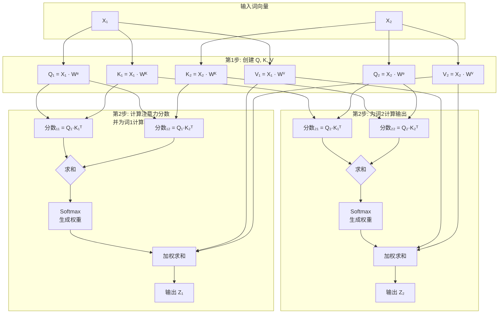

好的，我们来详细拆解一下 Self-Attention 的计算过程。虽然它的公式和普通注意力一样，但因为它所有输入都来自同一序列，所以理解其计算流程更能体会其精髓。

其最伟大的地方在于：**它为序列中的每个词都计算出了一个融入了全局上下文的全新表示**。

计算过程可以分为以下几步，我们用一个非常简单的例子来说明：

**例句**： "Thinking Machines" （两个词）
**目标**：为每个词计算一个全新的向量表示。

---

### 第1步：从输入向量创建Query, Key, Value

这是最关键的一步。我们有三个不同的权重矩阵：$W^Q$, $W^K$, $W^V$。这些矩阵是模型通过训练学习到的。

*   每个输入词向量（$x_1$ for "Thinking", $x_2$ for "Machines") 会分别与这三个矩阵相乘，从而生成三组向量：
    *   **Query 向量**：表示当前词作为“提问者”的身份。$q_1 = x_1 \cdot W^Q$, $q_2 = x_2 \cdot W^Q$
    *   **Key 向量**：表示当前词作为“被检索项”的身份。$k_1 = x_1 \cdot W^K$, $k_2 = x_2 \cdot W^K$
    *   **Value 向量**：表示当前词所包含的“实际信息”。$v_1 = x_1 \cdot W^V$, $v_2 = x_2 \cdot W^V$

**意义**：这就好比，同一个词“Thinking” ($x_1$)，在扮演不同角色时（提问、被检索、提供信息），会呈现出不同的侧面（$q_1$, $k_1$, $v_1$）。

为了更直观地理解整个流程，下图描绘了从输入词向量到最终输出的全过程，其中包含了Query、Key、Value的生成，以及注意力分数的计算和加权求和：

---

### 第2步：计算注意力分数

现在，我们想知道这个词序列中不同词之间的关联程度。

*   我们通过计算 **Query** 和 **Key** 的点积来衡量相关性。
*   对于“Thinking” ($x_1$) 来说，它需要计算与序列中每个词（包括自己）的分数：
    *   `分数_11` = $q_1 \cdot k_1^T$ （"Thinking" 与 "Thinking" 的关联度）
    *   `分数_12` = $q_1 \cdot k_2^T$ （"Thinking" 与 "Machines" 的关联度）

*   同样地，对于“Machines” ($x_2$)：
    *   `分数_21` = $q_2 \cdot k_1^T$
    *   `分数_22` = $q_2 \cdot k_2^T$

---

### 第3步：应用Softmax获得注意力权重

*   将上一步得到的分数进行缩放（除以 $\sqrt{d_k}$，其中 $d_k$ 是 Key 向量的维度）以稳定梯度。
*   然后，对缩放后的分数应用 Softmax 函数。**Softmax 是按行操作的**。

对于“Thinking” ($x_1$) 的分数行 `[分数_11, 分数_12]`：
*   `权重_11` = softmax(`分数_11` / $\sqrt{d_k}$)
*   `权重_12` = softmax(`分数_12` / $\sqrt{d_k}$)

**结果**：我们得到了一个概率分布，其和为1。这个分布代表了当编码“Thinking”这个词时，应该**分配多少注意力**给序列中的每个位置。

---

### 第4步：计算输出向量（上下文向量）

这是最后一步，生成的新向量就是 Self-Attention 的输出。

*   将上一步得到的每个权重，与对应的 **Value** 向量相乘，然后求和。

对于“Thinking” ($x_1$) 的输出 $z_1$：
$z_1 = \text{权重\_11} \cdot v_1 + \text{权重\_12} \cdot v_2$

对于“Machines” ($x_2$) 的输出 $z_2$：
$z_2 = \text{权重\_21} \cdot v_1 + \text{权重\_22} \cdot v_2$

**这就是 Self-Attention 的魔力所在！**
*   $z_1$ 不再是单纯的“Thinking”的原始表示 $x_1$，而是一个**全新的向量**。它融合了“Thinking”自身的信息 ($v_1$) 和根据其与“Machines”的关联度加权后的“Machines”的信息 ($v_2$)。
*   同理，$z_2$ 也融合了全局信息。

---

### 总结与关键点

1.  **并行计算**：上述所有计算都可以通过矩阵运算**并行完成**，效率极高。这也是Transformer比RNN快得多的原因之一。
2.  **角色分离**：通过 $W^Q$, $W^K$, $W^V$ 三个矩阵，让同一个输入词在不同场景下扮演不同角色。
3.  **输出本质**：Self-Attention 的输出 $Z$ 是一个向量序列 $[z_1, z_2, ..., z_n]$。序列中的**每一个**向量都包含了序列中**所有其他向量**的信息，只是关注的程度（权重）不同。
4.  **可视化**：注意力权重矩阵（Softmax后的结果）通常可以被可视化，成为理解模型决策过程的窗口，让我们看到模型在处理一个词时到底在“看”句子的哪些部分。这就是所谓的**模型可解释性**。

这个过程就是 Transformer 构建其强大理解能力的基石。每个词不再是孤立的，而是通过与序列中所有其他词的“交流”，获得了更深层次、更准确的表征。，获得了更深层次、更准确的表征。