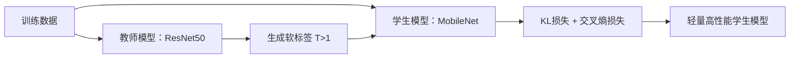

知识蒸馏（Knowledge Distillation, KD）是一种**模型压缩技术**，旨在将大型复杂模型（教师模型）的知识“迁移”到小型轻量模型（学生模型）中，使小模型在保持较高性能的同时显著降低计算成本和存储需求。

---

### **核心思想**
1. **“教师-学生”范式**：
   - **教师模型（Teacher）**：通常是庞大、高性能但计算昂贵的模型（如BERT、ResNet）。
   - **学生模型（Student）**：小型、高效的模型（如MobileNet、TinyBERT）。
   - **目标**：让学生模型模仿教师模型的输出行为，而非仅拟合原始数据标签。

2. **知识的定义**：
   - **软标签（Soft Targets）**：教师模型输出的**概率分布**（如分类任务中各类别的概率），包含更多信息（如类别间相似性）。
     - 例：猫 vs 狗 vs 汽车，教师可能输出 `[0.7, 0.29, 0.01]`，暗示“猫和狗相似，与汽车差异大”。
   - **硬标签（Hard Labels）**：原始训练数据的标签（如 `[1, 0, 0]`），仅包含正确类别信息。

---

### **关键步骤**
1. **训练教师模型**：  
   在训练集上训练一个高性能的复杂模型。

2. **生成软标签**：  
   用教师模型对训练数据预测，生成**概率分布（软标签）**。引入**温度参数（Temperature, T）** 软化概率分布：
   ```
   q_i = exp(z_i / T) / ∑_j exp(z_j / T)
   ```
   - `T > 1`：概率分布更平滑，暴露类别间关系（核心知识）。  
   - `T = 1`：标准Softmax输出。

3. **训练学生模型**：  
   学生模型同时学习：
   - **软目标损失**：匹配教师模型的软标签（如KL散度损失）。
   - **硬目标损失**：拟合原始数据的真实标签（如交叉熵损失）。
   ```
   总损失 = α * KL_loss(软标签, 学生输出) + (1-α) * CE_loss(真实标签, 学生输出)
   ```
   - `α`：平衡两项损失的权重。

4. **推理阶段**：  
   学生模型使用标准Softmax（`T=1`）进行预测。

---

### **为何有效？**
1. **知识泛化**：  
   软标签揭示了类别间的隐含关系（如“猫狗相似性”），学生模型学到更鲁棒的特征。
2. **正则化作用**：  
   软标签提供平滑的监督信号，避免学生模型过拟合硬标签中的噪声。
3. **优化难度降低**：  
   教师的软标签为优化提供更丰富的梯度信息，帮助学生模型更快收敛。

---

### **典型应用场景**
| 场景 | 说明 |
|------|------|
| **模型压缩** | 将BERT压缩为TinyBERT，推理速度提升10倍+ |
| **模型部署** | 在手机/嵌入式设备部署轻量模型（如蒸馏版ResNet） |
| **跨模态迁移** | 教师（多模态模型）→ 学生（单模态模型） |
| **联邦学习** | 教师整合全局知识，蒸馏给学生本地模型 |

---

### **经典变体**
- **特征蒸馏**：让学生中间层特征图匹配教师的特征（如FitNets）。
- **关系蒸馏**：迁移样本间的关系（如RKD）。
- **自蒸馏**：同一模型同时作为教师和学生（如Deep Mutual Learning）。
- **数据无关蒸馏**：无需原始数据，生成合成数据蒸馏（如DAFL）。

---

### **示例流程（图像分类）**


---

### **意义总结**
知识蒸馏本质是**知识的迁移与泛化**，通过教师模型的“经验”指导学生模型，使其以更小的体量达到接近教师的性能，是平衡模型效率与效果的利器。尤其在边缘计算、实时系统中，它是不可或缺的技术之一。

如果需要进一步探讨某个细节（如具体算法实现、最新论文方向），欢迎随时提问！ 😊��最新论文方向），欢迎随时提问！ 😊