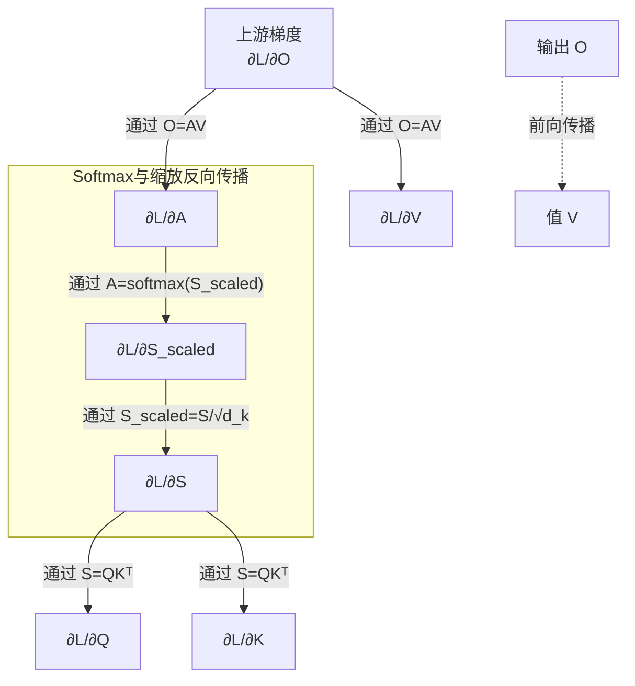

非常好的问题！理解注意力机制的反向传播是理解其如何学习的关键。注意力机制最优雅的地方在于它**完全是可微的**，这意味着我们可以通过标准的反向传播算法来学习其中的参数。

我们再次回顾前向传播的步骤：
1.  **分数（Scores）**: $S = QK^T$
2.  **缩放与权重（Weights）**: $A = \text{softmax}\left(\frac{S}{\sqrt{d_k}}\right)$
3.  **输出/上下文向量（Output）**: $O = AV$

反向传播的目标是计算最终损失函数 $L$ 关于输入矩阵 $Q$, $K$, $V$ 的梯度（即 $\frac{\partial L}{\partial Q}$, $\frac{\partial L}{\partial K}$, $\frac{\partial L}{\partial V}$），以便用梯度下降来更新生成 $Q$, $K$, $V$ 的权重参数。

我们**从后往前**（链式法则）来推导：

---

### 第1步：计算关于 $V$ 的梯度

这是最简单的一步。根据前向公式 $O = AV$，我们可以直接写出：
$$\frac{\partial L}{\partial V} = A^T \frac{\partial L}{\partial O}$$
**解释**：因为 $O$ 是 $A$ 和 $V$ 的矩阵乘法结果，关于 $V$ 的梯度就是注意力权重矩阵 $A$ 的转置乘以上游传回来的梯度 $\frac{\partial L}{\partial O}$。这和我们熟悉的全连接层的反向传播规则一致。

---

### 第2步：计算关于 $A$ 的梯度

同样根据 $O = AV$，我们可以得到：
$$\frac{\partial L}{\partial A} = \frac{\partial L}{\partial O} V^T$$
**解释**：上游梯度 $\frac{\partial L}{\partial O}$ 与 $V$ 的转置相乘，就得到了损失对注意力权重矩阵 $A$ 的梯度。这个梯度告诉我们：“为了减小损失，每个注意力权重应该变大还是变小”。

---

### 第3步：计算关于 $S$ 的梯度（这是最核心的一步）

这一步是反向传播通过 **Softmax** 函数。这是一个标准操作，但非常重要。
前向过程是 $A = \text{softmax}(S_{\text{scaled}}) = \text{softmax}(S / \sqrt{d_k})$。

假设 $S_{\text{scaled}} = S / \sqrt{d_k}$，且 $A = \text{softmax}(S_{\text{scaled}})$。那么，对于 Softmax 函数的反向传播，有一个非常优雅的结果：

如果有一个向量输入 $x$ 和向量输出 $y = \text{softmax}(x)$，那么雅可比矩阵 $\frac{\partial y}{\partial x}$ 是一个对称矩阵，其元素为：
$$\frac{\partial y_i}{\partial x_j} = y_i(\delta_{ij} - y_j)$$
其中 $\delta_{ij}$ 是克罗内克函数（当 $i = j$ 时为1，否则为0）。

这意味着，**从上游传回来的梯度 $\frac{\partial L}{\partial A}$ 在通过 Softmax 层时，会按以下方式转换**：
$$\frac{\partial L}{\partial S_{\text{scaled}}}} = A \circ \left( \frac{\partial L}{\partial A} - \text{sum}\left( \frac{\partial L}{\partial A} \circ A, \text{ axis=1} \right) \right)$$
这里 $\circ$ 表示逐元素相乘（Hadamard积），`sum(..., axis=1)` 表示对每一行进行求和。

**直观理解**：Softmax 的梯度计算会考虑所有输出元素之间的相互作用。调整一个分数 $S_j$，不仅会影响它对应的注意力权重 $A_j$，还会影响所有其他权重 $A_{i \neq j}$（因为 Softmax 要求所有输出之和为1）。这个计算确保了梯度能正确地分配给所有分数。

最后，别忘了我们之前对分数进行了缩放：$S_{\text{scaled}} = S / \sqrt{d_k}$。所以还需要继续反向传播通过这个缩放操作：
$$\frac{\partial L}{\partial S} = \frac{\partial L}{\partial S_{\text{scaled}}}} \cdot \frac{1}{\sqrt{d_k}}$$

---

### 第4步：计算关于 $Q$ 和 $K$ 的梯度

现在我们有了关于分数矩阵 $S$ 的梯度 $\frac{\partial L}{\partial S}$。回想前向过程 $S = QK^T$。

1.  **关于 $Q$ 的梯度**:
    $$\frac{\partial L}{\partial Q} = \frac{\partial L}{\partial S} \cdot K$$
    这可以理解为：为了计算损失对某个查询向量 $q$ 的梯度，我们需要看这个 $q$ 与所有键向量 $k$ 计算出的分数受到了多大影响。

2.  **关于 $K$ 的梯度**:
    $$\frac{\partial L}{\partial K} = \left( \frac{\partial L}{\partial S} \right)^T \cdot Q$$
    同理，为了计算损失对某个键向量 $k$ 的梯度，我们需要看所有查询向量 $q$ 与这个 $k$ 计算出的分数受到了多大影响。

---

### 总结与直观理解

整个反向传播过程可以总结为以下流程图，展示了梯度是如何从输出 $O$ 一路回溯到输入 $Q$, $K$, $V$ 的：

**这个过程如何让模型学习？**

1.  **梯度从输出 `O`（上下文向量）传回**：`O` 被用来计算损失（例如，预测下一个词的对数概率）。如果预测错了，损失函数就会产生一个梯度，这个梯度意味着“这个上下文向量 `O` 应该更像正确答案才对”。
2.  **梯度指导权重 `A` 的调整**：这个梯度接着传回到注意力权重矩阵 `A`。它告诉模型：“你在这个时间步关注了错误的信息！你应该更多地关注输入序列中的 **那个** 词，而不是 **这个** 词。”
3.  **梯度最终调整 `Q`, `K`, `V` 的生成**：`A` 的梯度又进一步传回给 `Q`, `K`, `V`。由于 `Q`, `K`, `V` 本身是由可学习的权重参数（比如线性变换层）生成的，这些梯度会继续反向传播回去，**调整那些生成 `Q`, `K`, `V` 的权重参数**。
4.  **结果**：通过无数次这样的调整，模型学会了：
    *   如何生成更好的 `Q`, `K`, `V` 表示。
    *   对于解码器的某个特定位置（某个 `Query`），应该如何在编码器的所有输出（`Keys`）上分配注意力（`A`），才能生成最有助于正确预测的上下文向量（`O`）。

本质上，**反向传播使注意力机制能够自动学习并优化“在哪里关注”以及“关注多少”的策略**，而无需任何人工标注的注意力指导。这就是它如此强大和高效的原因。